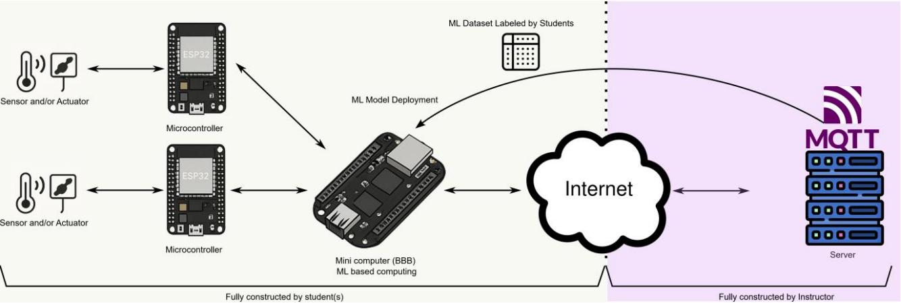

# 👋 touchswipe-identifier: AIoT Capacitive Swipe User Identification

An AIoT (Artificial Intelligence of Things) system designed to identify users based on their unique capacitive swipe patterns. This project leverages an ESP32 microcontroller for data acquisition, a BeagleBone Black for edge processing and machine learning inference, and an MQTT server for initial data aggregation.

## 📜 Project Overview

Inspired by the "AIoT Project: Machine Learning and Sensor Networks" course guidelines, this project aims to provide hands-on experience with AIoT technologies. We collect real-time sensor data, process it, train a machine learning model, and deploy it for user identification.

The core idea is to capture the distinct way individuals interact with a series of capacitive touch sensors. By analyzing both the electrical capacitance change and the duration of touch on each sensor strip during a swipe, we can create a unique "fingerprint" for each user.



**Project Goals:**
1.  Collect real-time capacitive touch data using ESP32.
2.  Transmit this data to a BeagleBone Black (BBB) via Bluetooth.
3.  Initially, forward data from BBB to a central MQTT server (for backup and instructor oversight, as per course requirements).
4.  Train a supervised machine learning model on the collected dataset.
5.  Deploy the trained model onto the BeagleBone Black.
6.  Transition to a system where the BBB performs real-time user identification based on live ESP32 data, without relying on the MQTT server for the prediction step.

## ✨ Key Features

*   **Capacitive Sensing:** Utilizes 9 copper tape strips connected to ESP32 touch pins.
*   **Dual-Feature Data:** Captures both raw capacitive touch values and the duration of touch on each strip.
*   **Wireless Communication:** ESP32 transmits data to BeagleBone Black via Bluetooth.
*   **Edge ML Deployment:** BeagleBone Black hosts the trained machine learning model for local inference.
*   **Phased Data Flow:**
    *   **Phase 1 (Data Collection):** ESP32 → Bluetooth → BBB → MQTT Server → Local CSV Backup on BBB.
    *   **Phase 2 (Inference):** ESP32 → Bluetooth → BBB (ML Model) → User Prediction.
*   **User Interface:**
    *   Two physical buttons on ESP32 setup for managing data collection: one for new trial (same user), one for new user.
    *   RGB LED for visual feedback (touch detection, button presses, system states).
*   **Data Integrity:** Real-world sensor data collection, adhering to project guidelines against synthetic data.

## ⚙️ System Architecture

The system is composed of three main tiers:

1.  **Sensing & Acquisition (ESP32):**
    *   An ESP32 microcontroller is connected to 9 copper tape strips acting as capacitive touch sensors.
    *   It reads the raw touch values and calculates the duration of each touch.
    *   User/trial management is handled via push-buttons.
    *   An RGB LED provides status feedback.
    *   Data is formatted as a CSV string and sent via Bluetooth.

2.  **Processing & Inference (BeagleBone Black):**
    *   The BBB acts as a gateway and edge ML processor.
    *   It receives data from the ESP32 via a Bluetooth serial connection (`rfcomm`).
    *   **During data collection:** It forwards the received data to the instructor-managed MQTT server and also saves it locally to a `veriseti.csv` file.
    *   **After model deployment:** It will receive data, preprocess it if necessary, feed it to the onboard ML model, and output a user prediction.

3.  **Data Aggregation & Backup (MQTT Server - Initial Phase):**
    *   An instructor-provided MQTT server is used during the data collection phase.
    *   This ensures data is backed up and allows the instructor to monitor data collection progress.
    *   Access is secured via TLS and username/password authentication.

## 🔧 How It Works

**Data Flow:**
`Copper Tapes` → `ESP32` (reads touch values & duration) → `Bluetooth` → `BeagleBone Black` →
    1.  **(Data Collection Phase):** `Local CSV Storage` & `MQTT Server`
    2.  **(Prediction Phase):** `ML Model on BBB` → `Predicted User`

**User Interaction:**
*   A user performs a swipe gesture (e.g., left-to-right) across the 9 copper tapes.
*   The ESP32 records the sequence of touch values and the time spent on each tape.
*   This generates a feature vector of 18 values (9 touch readings + 9 duration readings) per swipe instance, plus user/trial ID and timestamp.
*   Buttons allow for labeling data for different users and different trials for the same user.

## 🧠 Machine Learning Aspect

*   **Dataset:** The dataset consists of time-series data from the 9 capacitive sensors. Each row includes:
    *   `User_TrialID` (e.g., User0.0, User0.1, User1.0)
    *   `Timestamp`
    *   `rawT9, rawT8, ..., rawT0` (Raw capacitive values for 9 sensors)
    *   `ongoingDurT9, ongoingDurT8, ..., ongoingDurT0` (Duration of touch on each of the 9 sensors)
*   **Features:** 18 primary features (9 raw values + 9 duration values).
*   **Task:** Supervised multi-class classification. The model will be trained to predict the `UserID` based on the 18 input features.
*   **Why ML is needed:** A simple rule-based or threshold system would likely fail to capture the complex, dynamic, and combined patterns of electrical values and swipe speeds that uniquely characterize an individual's touch. ML models can learn these nuanced patterns.
*   **Potential Models:** Logistic Regression, Decision Trees, Random Forest, KNN, SVM, or even simple Neural Networks could be explored.

## 🚀 Our Development Journey & Milestones

1.  **Initial Setup & Prototyping:**
    *   Acquired BeagleBone Black from instructor. Faced initial challenges connecting it to the internet.
    *   Ordered ESP32. Upon arrival, successfully tested capacitive touch reading with a single copper tape.
    *   Scaled up to 9 copper tapes, confirming data acquisition capabilities.
2.  **Hardware Assembly:**
    *   Mounted the ESP32 onto a cardboard base.
    *   Affixed 9 copper tape strips to the cardboard.
    *   Soldered jumper wires between the ESP32 touch pins and the copper tapes.
    *   Integrated a breadboard onto the assembly, adding:
        *   Two push-buttons: one for advancing trial ID (same user), one for advancing user ID.
        *   An RGB LED module for visual feedback (e.g., green blink on touch, button-specific colors).
3.  **Software & Connectivity - ESP32:**
    *   Developed ESP32 firmware to:
        *   Read all 9 touch sensors and calculate touch durations.
        *   Manage user and trial IDs based on button inputs.
        *   Provide LED feedback.
        *   Format data as CSV strings.
        *   Transmit data to the BeagleBone Black via Bluetooth serial.
4.  **Software & Connectivity - BeagleBone Black:**
    *   **Resolved Internet Issue:** Installed Debian 12 on the BBB, which resolved the network connectivity problems.
    *   Developed Python script to:
        *   Establish a Bluetooth serial connection (`/dev/rfcomm0`) to receive data from the ESP32.
        *   Parse the incoming CSV data.
        *   **Forward data to the instructor's MQTT server.**
        *   **Simultaneously save the data locally to `veriseti.csv` on the BBB.**
5.  **Current Stage & Next Steps:**
    *   Actively collecting swipe data from multiple users.
    *   **Next:**
        *   Gather a sufficient and diverse dataset (minimum 2 weeks as per guidelines).
        *   Preprocess and clean the collected data.
        *   Train various machine learning models.
        *   Evaluate models and select the best performer.
        *   Deploy the chosen model onto the BeagleBone Black.
        *   Test the end-to-end real-time prediction system.

## 🛠️ Tech Stack

*   **Microcontroller:** ESP32 (WROOM32 or similar)
    *   Programming: C/C++ (Arduino Framework)
    *   Key Libraries: `BluetoothSerial.h`
*   **Edge Computer:** BeagleBone Black
    *   OS: Debian 12
    *   Programming: Python 3
    *   Key Libraries: `paho-mqtt` (for MQTT communication), `pyserial` (for Bluetooth serial)
*   **Sensors:** 9x Copper Tape Strips (as capacitive touch pads)
*   **Communication Protocols:**
    *   Bluetooth (ESP32 ↔ BBB)
    *   MQTT (BBB → MQTT Server) over TLS
*   **Machine Learning (Planned):**
    *   Python
    *   Libraries: Scikit-learn, Pandas, NumPy (or other relevant ML/data processing libraries)
*   **Cloud/Remote Service:** EMQ XSL MQTT Broker (instructor-provided)

## 🔧 Setup & Installation

**1. ESP32:**
   *   Install Arduino IDE or PlatformIO.
   *   Install the ESP32 board definitions.
   *   Ensure necessary libraries (like `BluetoothSerial.h`) are available.
   *   Wire the copper tapes to the defined touch pins (T0, T2-T9).
   *   Wire buttons and RGB LED to respective GPIO pins.
   *   Upload the `esp32_touch_sender.ino` (or your equivalent C++ code) to the ESP32.
   *   Note the Bluetooth device name configured in the ESP32 code (e.g., "ESP32_TouchData").

**2. BeagleBone Black:**
   *   Ensure Debian 12 (or a compatible Linux distribution) is running.
   *   Install Python 3 and pip.
   *   Install required Python libraries:
     ```bash
     pip install paho-mqtt pyserial
     ```
   *   **Bluetooth Pairing & Binding:**
      1.  Scan for Bluetooth devices: `hcitool scan` (or `bluetoothctl scan on`). Identify your ESP32.
      2.  Pair with the ESP32 using `bluetoothctl`.
      3.  Bind the ESP32's MAC address to a serial port (e.g., `/dev/rfcomm0`):
          ```bash
          sudo rfcomm bind 0 XX:XX:XX:XX:XX:XX 1 
          # Replace XX:XX:XX:XX:XX:XX with your ESP32's MAC address
          # The '1' is the RFCOMM channel, typically 1 for SPP.
          ```
          You might need to install `bluez-tools` or `rfcomm` if not present.
   *   Place the CA certificate (`emqxsl-ca.crt`) in the specified path (e.g., `/home/debian/emqxsl-ca.crt`).
   *   Configure MQTT broker details, serial port, and CSV file path in the `bbb_mqtt_bluetooth_logger.py` script.

**3. MQTT Broker:**
   *   Ensure you have the correct broker address, port, username, password, and CA certificate from your instructor.

## ▶️ Usage

1.  **Power on the ESP32.** It will start broadcasting as a Bluetooth device.
2.  **On the BeagleBone Black:**
    *   Ensure Bluetooth is enabled and the ESP32 is paired and bound to `/dev/rfcomm0` (or the configured port).
    *   Run the Python script:
        ```bash
        python3 bbb_mqtt_bluetooth_logger.py
        ```
    *   The script will attempt to connect to the ESP32 via Bluetooth and to the MQTT broker.
3.  **Data Collection:**
    *   Use the "New Trial" button on the ESP32 setup to record multiple swipes for the current user.
    *   Use the "New User" button to switch to a new user ID for data labeling.
    *   Perform swipe gestures across the copper tapes.
    *   The ESP32 will send data to the BBB.
    *   The BBB will print received data to its console, save it to the local CSV file (`veriseti.csv`), and publish it to the MQTT topic.
4.  **(Future - Post Model Deployment):** The BBB script will be updated to load the ML model and perform predictions instead of (or in addition to) MQTT forwarding.

## 📁 Folder Structure (Example)

touchswipe-identifier/
├── esp32_code/ # Arduino sketch for ESP32
│ └── esp32_touch_sender.ino
├── bbb_code/ # Python script for BeagleBone Black
│ └── bbb_mqtt_bluetooth_logger.py
│ └── emqxsl-ca.crt # MQTT Broker CA Certificate
├── dataset/ # Where collected data might be stored or analyzed
│ └── veriseti.csv # (This is created on the BBB, example location)
├── ml_model/ # Jupyter notebooks, model files (e.g., .pkl)
│ └── training_notebook.ipynb
│ └── swipe_model.pkl
├── docs/ # Project documentation, diagrams
│ └── AloT_Project_Info.pdf
│ └── system_diagram.png
└── README.md # This file


## 🔮 Future Work & Potential Improvements

*   **Advanced ML Models:** Experiment with more complex models like LSTMs or GRUs if sequential nature is highly critical and simpler models don't suffice.
*   **Real-time Dashboard:** Develop a simple web interface hosted on the BBB to display live predictions.
*   **Gesture Expansion:** Extend the system to recognize more complex gestures beyond simple swipes.
*   **Model Optimization:** Quantize or prune the ML model for even better performance on the BBB.
*   **Robustness:** Implement more error handling and reconnection logic in both ESP32 and BBB code.
*   **Security Enhancements:** If deploying in a less controlled environment, further secure the Bluetooth communication.

## 🤝 Contributing

Details on how to contribute if this were a larger open-source project (e.g., fork, branch, pull request). For this course project, collaboration is within the team.

## 📝 License

Specify a license if applicable (e.g., MIT, Apache 2.0). For a course project, this might be "Educational Use Only" or similar.
